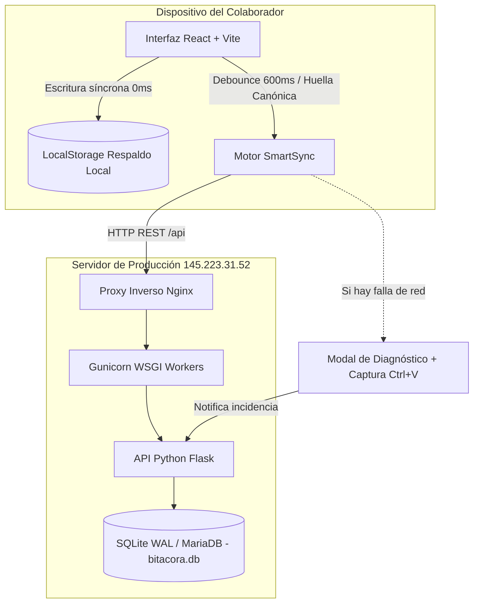
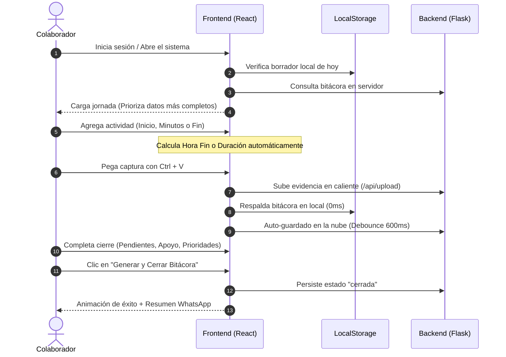

# 📘 Manual Integral de Aprendizaje, Procesos y Operaciones
## Sistema de Bitácora Diaria de Actividades • Marketing Alterno Perú

---

### 🌟 Introducción y Filosofía del Sistema
El **Sistema de Bitácora Diaria de Actividades** es una plataforma corporativa *Offline-First* diseñada para registrar, sincronizar, supervisar y auditar la productividad laboral del equipo en tiempo real.

Su arquitectura garantiza que **ningún colaborador pierda información jamás**: cada pulsación, cada actividad y cada evidencia se resguardan de manera instantánea y síncrona en el almacenamiento local del navegador (`localStorage`) y se transmiten automáticamente a los servidores en la nube mediante un motor de sincronización inteligente con tolerancia a caídas de red.

---



---

## 👥 1. Matriz de Roles y Niveles de Acceso

El sistema cuenta con **4 perfiles de operación** claramente diferenciados:

| Rol / Perfil | Alcance | Funcionalidades Principales |
| :--- | :--- | :--- |
| **Colaborador / Analista** | Personal | • Registro de tareas diarias con cálculo horario bidireccional.<br>• Pegado directo de capturas con `Ctrl + V`.<br>• Compartir tareas en paralelo con compañeros.<br>• Cierre de jornada con exportación a WhatsApp.<br>• Consulta de historial y papelera propia. |
| **Usuario de Apoyo (Delegado)** | Multinivel (1 o varios colaboradores) | • Conmutador **Modo Apoyo** en barra superior.<br>• Registro y edición de actividades directamente en la jornada de otros colaboradores asignados.<br>• Aislamiento estricto de borradores locales por usuario. |
| **Líder de Equipo** | Departamental | • Vista **Supervisión de Equipo** con avance en tiempo real.<br>• Tablero **Kanban** del equipo.<br>• Dashboard de métricas, horas hombre y KPIs.<br>• Consulta de bitácoras de su departamento. |
| **Administrador del Sistema** | Global (Full Access) | • Vista **Gestión del Sistema** (usuarios, equipos y roles).<br>• Asignación y revocación de **Delegaciones de Apoyo**.<br>• Bóveda de Accesos Directos & Credenciales TI (AES-256 + Excel).<br>• Configuración institucional (logos, títulos, horarios default).<br>• Centro de Diagnóstico Técnico y auditoría de eventos. |

---

## 🌅 2. Ciclo de Vida de la Jornada Laboral (Paso a Paso)



---

### Paso 1: Apertura de la Jornada
1. Al ingresar a `Mi Bitácora`, el sistema detecta automáticamente la fecha local de Perú (`America/Lima`, UTC-5).
2. Se asigna la **Hora de Inicio** estándar de la empresa (`08:30` configurable desde Administración).
3. **SmartSync Automático:** Si el día anterior se cerró el navegador con tareas pendientes que no alcanzaron a sincronizarse por un corte de internet, el sistema las detecta y las sincroniza silenciosamente con la nube sin intervención del usuario.

### Paso 2: Registro de Actividades con Motor de Tiempo Inteligente
Al pulsar **`+ Nueva Actividad`**, se despliega el modal de registro:

* **Motor de Tiempo Bidireccional:**
  * **Si escribes la Duración:** Por ejemplo, Hora Inicio `09:00` y escribes `90` minutos, la **Hora Fin** se fija automáticamente en `10:30`.
  * **Si ajustas la Hora Fin:** Por ejemplo, indicas que terminaste a las `11:45`, el campo de **Duración** calcula instantáneamente `165 minutos (2h 45m)`.
  * **Botón `⚡ Ahora`:** Pulsa este botón al finalizar una tarea en tiempo real; el sistema colocará la hora actual exacta y calculará los minutos invertidos.
  * **Atajos Rápidos de Minutos:** Botones `+15m`, `+30m` y `+1h` para añadir tiempo en un solo clic.

* **Subida Directa de Evidencias (`Ctrl + V`):**
  * Toma cualquier captura de pantalla (con `Win + Shift + S`, `PrtScr` o la Herramienta Recortes).
  * Dentro del modal, simplemente presiona **`Ctrl + V`**.
  * La imagen se procesará y se adjuntará automáticamente a la actividad.

* **Tareas Compartidas en Paralelo (`shared_with`):**
  * Si trabajaste junto a uno o más compañeros en una misma tarea (reunión, soporte técnico conjunto, despliegue), selecciónalos en el campo **Compartir con**.
  * Al guardar, el sistema replicará automáticamente la actividad en la bitácora de cada compañero seleccionado, manteniendo la coherencia de tiempos y descripciones.

* **Vinculación de Subtareas / Tareas Relacionadas:**
  * Puedes vincular la actividad a una tarea previa mediante el buscador de referencias, estableciendo vínculos de tipo *Dependencia*, *Continuación*, *Bloqueo* o *Revisión*.

---

### Paso 3: Cierre de Jornada y Formalización
Al terminar el día laboral:
1. En la sección inferior **Cierre de Jornada**, documenta:
   * **Tareas Pendientes:** Tareas que quedan abiertas para el día siguiente.
   * **¿Necesita Apoyo?:** Selecciona *Sí* o *No*. Si seleccionas *Sí*, detalla el motivo y con qué equipo/área requieres soporte.
   * **Prioridad para Mañana:** Objetivo principal para arrancar la siguiente jornada.
2. Pulsa el botón **`🚀 Generar Bitácora`**:
   * El sistema validará los datos, activará la celebración visual y marcará la bitácora como formalmente generada.
   * Se abrirá el modal de **Compartir por WhatsApp**, con un texto perfectamente tabulado y formateado con emojis corporativos para enviarlo a tu supervisor, grupo de equipo o a tu propio número como constancia.

---

## 🤝 3. Modo Apoyo (Registro Delegado de Bitácoras)

El **Modo Apoyo** permite que un usuario autorizado (asistente, apoyo operativo, compañero de guardia o administrador) registre bitácoras completas para uno o varios colaboradores:

1. **Activar Modo Apoyo:**
   * En la barra superior, haz clic en el botón con icono de apretón de manos **`Modo Apoyo`**.
   * Si tienes más de un colaborador asignado, aparecerá un buscador rápido donde podrás seleccionar a quién deseas apoyar.
2. **Registro Aislado:**
   * Una vez seleccionado el colaborador, la barra de bitácora se pintará con un banner distintivo ámbar:
     > `🤝 Registrando para: Juan Pérez (Equipo de Sistemas)`
   * Todas las tareas, horas de inicio y cierres que ingreses se guardarán en la bitácora de **Juan Pérez**.
   * **Seguridad de Datos:** El sistema guarda copias locales independientes (`bitacora_draft_<id_usuario>_<fecha>`), impidiendo que los borradores de tus compañeros se mezclen con tu propia bitácora personal.
3. **Salir del Modo Apoyo:**
   * Haz clic en la `X` o en el botón **`Volver a mi bitácora`** en cualquier momento para regresar instantáneamente a tu jornada.

---

## 🛠️ 4. Bóveda TI & Gestor de Accesos Directos (`/vault`)

Módulo diseñado para centralizar y proteger los accesos institucionales:

* **Seguridad Criptográfica AES-256:** Las contraseñas de las plataformas corporativas se almacenan cifradas en base de datos. Solo los usuarios con permisos explícitos pueden visualizarlas (previo desbloqueo con PIN de seguridad).
* **Plantilla e Importación Masiva en Excel:**
  1. Ingresa a la pestaña *Bóveda TI*.
  2. Haz clic en **`Descargar Plantilla Excel`**.
  3. Llena la información en el archivo `.xlsx` (Empresa, Marca, Plataforma, Usuario, Contraseña, URL de Acceso).
  4. Pulsa **`Importar Excel`**, selecciona el archivo y el sistema creará y actualizará las cuentas automáticamente.

---

## 🗑️ 5. Papelera de Reciclaje Inteligente

Para evitar pérdidas por eliminaciones accidentales:
* Cuando eliminas una actividad, esta **no se destruye físicamente de la base de datos**. Se aplica un marcado de *Soft-Delete* (`is_deleted = 1, deleted_at = NOW()`).
* Puedes acceder a la **Papelera** desde el menú lateral.
* Al pulsar **`Restaurar`**, la actividad regresa de inmediato a su posición en la bitácora del día correspondiente, manteniendo sus horas, evidencias y vínculos originales.

---

## ⚠️ 6. Centro de Diagnóstico Técnico & Reporte de Incidencias

Si ocurre un microcorte de internet o el servidor tarda en responder:

1. El botón de la nube en la cabecera superior y el pie de la lista cambiarán al estado **`⚠️ Sin conexión`** o **`⚠️ Ver detalle / Reportar`**.
2. Al hacer clic, se abre el modal interactivo de **Diagnóstico Técnico**:
   * **Mensaje del Sistema:** Muestra el error exacto (ej. *HTTP 500: Database busy* o *Timeout de red*).
   * **Pegar Captura del Problema (`Ctrl + V`):** Puedes adjuntar una captura del error directamente.
   * **Copiar Reporte:** Genera un texto técnico estructurado listo para enviar por chat a soporte.
   * **Reportar a Sistemas:** Envía una alerta automática a los administradores del sistema con la traza de error y la captura adjunta.
   * **Reintentar Guardar:** Vuelve a forzar la sincronización en la nube tan pronto se restablece el enlace.

> [!NOTE]
> Mientras el estado marque *Sin conexión*, tus datos **siguen 100% seguros y respaldados en tu navegador**. Puedes seguir registrando tareas con total tranquilidad; el sistema las sincronizará en cuanto se reanude la conexión.

---

## 🚀 7. Protocolo de Despliegue y Mantenimiento del Servidor

Para sincronizar los cambios de este repositorio en el servidor VPS de producción (`145.223.31.52`):

```bash
# 1. Ingresar al directorio del proyecto en el servidor
cd /var/www/bitacora

# 2. Descargar las últimas actualizaciones de la rama main
git pull origin main

# 3. Reiniciar el servicio backend (Gunicorn liberará conexiones y aplicará nuevas rutas/migraciones)
sudo systemctl restart bitacora-backend

# 4. Recompilar los assets del frontend de producción
cd frontend && npm run build
```

### Comprobación de Salud del Servidor:
```bash
# Verificar estado del servicio backend
sudo systemctl status bitacora-backend

# Verificar respuesta de la API
curl -s http://localhost:5000/api/health
```

---
*Manual generado y validado con éxito para Marketing Alterno Perú • Versión 2.2.0*
